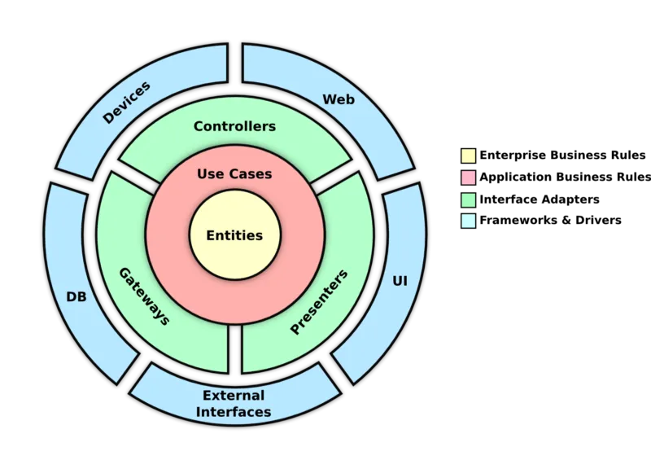

## Technical Test - Software Engineer at Dealls

        
    Author: Miftakhul Aziz
    Email: mftakhullaziz@gmail.com

### API Documentation

    Postman Link
    https://documenter.getpostman.com/view/6097899/2sA3XLF4jf

### Architecture Service

###### This project building using implement clean architecture, with details

#### infra

#### delivery

#### core

#### domain

### Tech Stack
    Golang 1.22
    JWT
    MySQL
    Redis

### Loggers
    For logger mekanisme will be created in path build/logs the logger 
    auto create new after 10000 like, and logger in before will be save 
    to make history file

### How to Run
    
    Use makefile
    
    make build/service -> this for build project to binary go
    make run/service -> this for running binary go service
    make brun/service -> this for build and running
